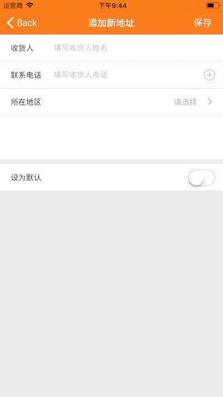
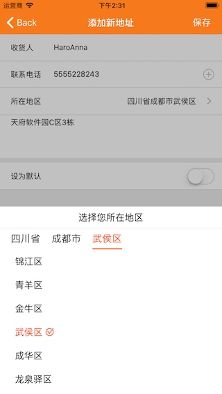
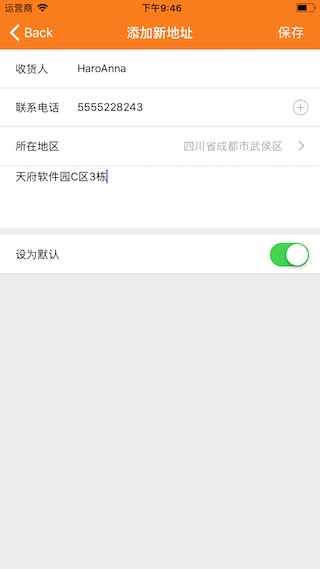

# YWChooseAddressView

> 高仿淘宝添加新地址UI、高仿京东地区选择器

### UI效果图
<div align="center">    
	
	
	
</div>

### 从通讯录获取联系人信息（姓名、电话）
```
#pragma mark *** 从通讯录选择联系人 电话 & 姓名 ***
//用户点击 加号按钮 - 选择联系人
- (void)selectContactAction {
    // 弹出联系人列表 - 此方法只使用于 iOS 9.0以后
    CNContactPickerViewController * pickerVC = [[CNContactPickerViewController alloc]init];
    pickerVC.navigationItem.title = @"选择联系人";
    pickerVC.delegate = self;
    [self presentViewController:pickerVC animated:YES completion:nil];
}

//这个方法在用户取消选择时调用
- (void)contactPickerDidCancel:(CNContactPickerViewController *)picker; {
    [self dismissViewControllerAnimated:YES completion:nil];
}

#pragma mark - CNContactPickerDelegate
// 这个方法在用户选择一个联系人后调用
- (void)contactPicker:(CNContactPickerViewController *)picker didSelectContact:(CNContact *)contact {
    // 1.获取姓名
    NSString *firstname = contact.givenName;
    NSString *lastname = contact.familyName;
    NSLog(@"%@%@", lastname, firstname);
    
    //通过姓名寻找联系人
    NSMutableString *fullName = [[NSMutableString alloc] init];
    if ( lastname != nil || lastname.length > 0 ) {
        [fullName appendString:lastname];
    }
    if ( firstname != nil || firstname.length > 0 ) {
        [fullName appendString:firstname];
    }
    
    // 2.获取电话号码
    NSArray *phones = contact.phoneNumbers;
    NSMutableArray *phoneNumbers = [NSMutableArray array];
    // 3.遍历电话号码
    for (CNLabeledValue *labelValue in phones) {
        CNPhoneNumber *phoneNumber = labelValue.value;
        //把 -、+86、空格 这些过滤掉
        NSString *phoneStr = [phoneNumber.stringValue stringByReplacingOccurrencesOfString:@"-" withString:@""];
        phoneStr = [phoneStr stringByReplacingOccurrencesOfString:@"+86" withString:@""];
        phoneStr = [phoneStr stringByReplacingOccurrencesOfString:@" " withString:@""];
        [phoneNumbers addObject:phoneStr];
    }
    
    NSLog(@"选择的姓名：%@， 电话号码：%@", fullName, phoneNumbers.firstObject);
    _nameStr = fullName;
    // 这里直接取第一个电话号码，如果有多个请自行添加选择器
    _phoneStr = phoneNumbers.firstObject;
    [_tableView reloadData];
    
    [picker dismissViewControllerAnimated:YES completion:nil];
}


```

### 弹出地区选择器视图
```
#pragma mark *** 弹出选择地区视图 ***
- (void)chooseAddress {
    WeakSelf;
    [UIView animateWithDuration:0.5 delay:0 options:UIViewAnimationOptionCurveLinear animations:^{
        weakSelf.coverView.frame = CGRectMake(0, 0, YWScreenW, YWScreenH);
        weakSelf.chooseAddressView.hidden = NO;
    } completion:^(BOOL finished) {
        // 动画结束之后添加阴影
        weakSelf.coverView.backgroundColor = [UIColor colorWithWhite:0 alpha:0.2];
    }];
}

- (BOOL)gestureRecognizerShouldBegin:(UIGestureRecognizer *)gestureRecognizer {
    CGPoint point = [gestureRecognizer locationInView:gestureRecognizer.view];
    if (CGRectContainsPoint(_chooseAddressView.frame, point)){
        return NO;
    }
    return YES;
}


- (void)tapCover:(UITapGestureRecognizer *)tap {
    if (_chooseAddressView.chooseFinish) {
        _chooseAddressView.chooseFinish();
    }
}

- (YWChooseAddressView *)chooseAddressView {
    if (!_chooseAddressView) {
        WeakSelf;
        _chooseAddressView = [[YWChooseAddressView alloc]initWithFrame:CGRectMake(0, [UIScreen mainScreen].bounds.size.height - 350, [UIScreen mainScreen].bounds.size.width, 350)];
        // 设置默认
        // _chooseAddressView.address = @"四川省成都市武侯区";
        // _chooseAddressView.areaCode = @"510107";
        _chooseAddressView.chooseFinish = ^{
            weakSelf.coverView.backgroundColor = [UIColor clearColor];
            NSLog(@"选择的地区为：%@", weakSelf.chooseAddressView.address);
            _areaAddress = weakSelf.chooseAddressView.address;
            if (_areaAddress.length == 0) {
                _areaAddress = @"请选择";
            }
            [weakSelf.tableView reloadData];
            // 隐藏视图 - 动画
            [UIView animateWithDuration:0.5 delay:0 options:UIViewAnimationOptionCurveLinear animations:^{
                weakSelf.coverView.frame = CGRectMake(0, YWScreenH, YWScreenW, YWScreenH);
                weakSelf.chooseAddressView.hidden = NO;
            } completion:nil];
        };
    }
    return _chooseAddressView;
}

- (UIView *)coverView {
    if (!_coverView) {
        _coverView = [[UIView alloc]initWithFrame:CGRectMake(0, YWScreenH, YWScreenW, YWScreenH)];
        [_coverView addSubview:self.chooseAddressView];
        UITapGestureRecognizer * tap = [[UITapGestureRecognizer alloc]initWithTarget:self action:@selector(tapCover:)];
        [_coverView addGestureRecognizer:tap];
        tap.delegate = self;
    }
    return _coverView;
}

@end

```
### 代码下载地址

[【Demo传送门 - github】](https://github.com/90candy/YWChooseAddressView)

